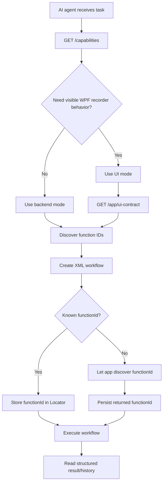
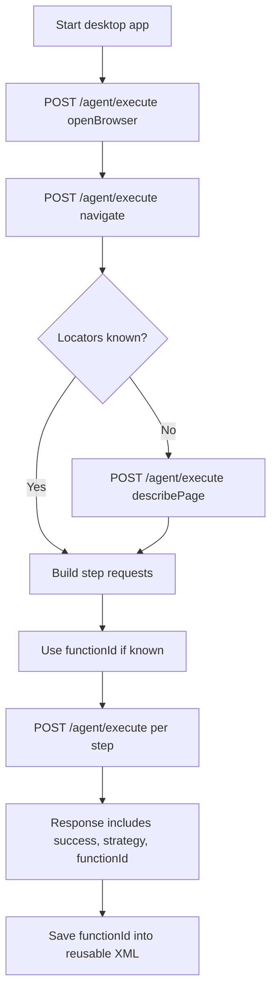
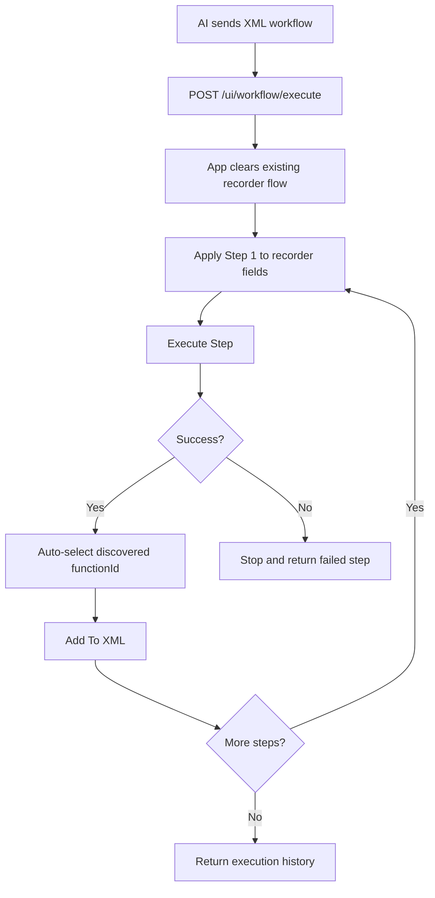
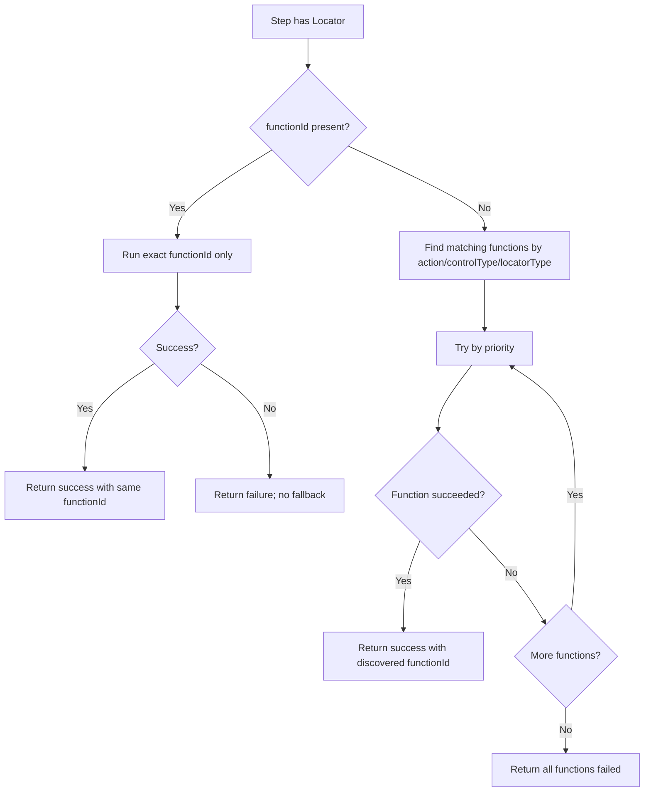
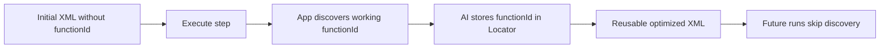

# AI Flow Creation Guide for AiBrowserMediator

Use this guide when an AI agent needs to create reusable XML workflows for AiBrowserMediator.


---

## Flow charts

### Overall agent decision flow



### Backend mode flow



### UI mode flow: use app like a human



### Strategy function selection flow



### XML reuse loop



## Core rule

Always create workflows that can be replayed quickly. Prefer storing the successful `functionId` in XML.

```xml
<Locator
  type="id"
  value="my-text-id"
  strategy="TextBox.IdStrategy"
  functionId="TextBox.Id.SetValueByClearAndSendKeys" />
```

If `functionId` is present, the app executes that exact function and skips strategy discovery.
If `functionId` is missing, the app tries matching functions by priority and returns the successful `functionId`.

---

## Two execution modes

### 1. Backend mode

Use when you want direct execution without updating the WPF recorder UI.

Endpoint:

```http
POST http://localhost:5050/agent/execute
```

Use this for fast automation.

### 2. UI mode

Use when you want the app to behave like a human using the WPF recorder: set fields, execute step, learn `functionId`, and add successful steps to XML.

Endpoints:

```http
GET  http://localhost:5050/app/ui-contract
POST http://localhost:5050/ui/workflow/execute
```

Use this when the UI must show the workflow-building process.

---

## Required agent sequence

1. Check bridge is running:

```http
GET http://localhost:5050/
```

2. Get available app capabilities:

```http
GET http://localhost:5050/capabilities
```

3. Discover available strategy functions:

```http
GET http://localhost:5050/capabilities/functions?controlType=textbox&locatorType=id&action=update
```

4. Open browser if needed:

```json
POST http://localhost:5050/agent/execute
{
  "id": 0,
  "action": "openBrowser"
}
```

5. Navigate:

```json
POST http://localhost:5050/agent/execute
{
  "id": 1,
  "action": "navigate",
  "url": "https://www.selenium.dev/selenium/web/web-form.html",
  "timeoutSeconds": 20,
  "controlType": "generic"
}
```

6. Describe page when locators are unknown:

```json
POST http://localhost:5050/agent/execute
{
  "id": 2,
  "action": "describePage"
}
```

7. Create XML using stable locators and known `functionId` values.

---

## Locator priority

Choose locators in this order:

1. Stable `id`
2. Stable `name`
3. Placeholder
4. Data attributes
5. Label mapping
6. CSS selector
7. Relative XPath
8. JavaScript fallback only if explicitly allowed

Avoid dynamic IDs such as:

```text
ctl00_123
a1b2c3
random_9999
```

---

## Common function IDs

### TextBox

```text
TextBox.Id.SetValueByClearAndSendKeys
TextBox.Name.SetValueByClearAndSendKeys
TextBox.Css.SetValueByClearAndSendKeys
TextBox.XPath.SetValueByClearAndSendKeys
TextBox.Id.GetValueByAttribute
```

### ComboBox

```text
ComboBox.Id.SelectByTextOrValue
ComboBox.Name.SelectByTextOrValue
ComboBox.Css.SelectByTextOrValue
ComboBox.XPath.SelectByTextOrValue
```

### CheckBox

```text
CheckBox.Id.SetCheckedByClickWhenNeeded
CheckBox.Name.SetCheckedByClickWhenNeeded
CheckBox.Css.SetCheckedByClickWhenNeeded
CheckBox.XPath.SetCheckedByClickWhenNeeded
```

### Button

```text
Button.Id.ClickByFindElement
Button.Name.ClickByFindElement
Button.Css.ClickByFindElement
Button.XPath.ClickByFindElement
```

---

## XML workflow format

```xml
<?xml version="1.0" encoding="utf-8"?>
<Workflow sessionId="S1">
  <Step id="1" action="navigate" url="https://www.selenium.dev/selenium/web/web-form.html" timeout="20" controlType="generic" />

  <Step id="2" action="update" timeout="20" controlType="textbox">
    <Locator
      type="id"
      value="my-text-id"
      strategy="TextBox.IdStrategy"
      functionId="TextBox.Id.SetValueByClearAndSendKeys" />
    <Value>Text1</Value>
  </Step>

  <Step id="3" action="update" timeout="20" controlType="combobox">
    <Locator
      type="name"
      value="my-select"
      strategy="ComboBox.NameStrategy"
      functionId="ComboBox.Name.SelectByTextOrValue" />
    <Value>One</Value>
  </Step>
</Workflow>
```

---

## Example: Selenium web form reusable XML

```xml
<?xml version="1.0" encoding="utf-8"?>
<Workflow sessionId="SeleniumWebForm">
  <Step id="1" action="navigate" url="https://www.selenium.dev/selenium/web/web-form.html" timeout="20" controlType="generic" />

  <Step id="2" action="update" timeout="20" controlType="textbox">
    <Locator type="id" value="my-text-id" strategy="TextBox.IdStrategy" functionId="TextBox.Id.SetValueByClearAndSendKeys" />
    <Value>Text1</Value>
  </Step>

  <Step id="3" action="update" timeout="20" controlType="textbox">
    <Locator type="name" value="my-password" strategy="TextBox.NameStrategy" functionId="TextBox.Name.SetValueByClearAndSendKeys" />
    <Value>Test2</Value>
  </Step>

  <Step id="4" action="update" timeout="20" controlType="textbox">
    <Locator type="name" value="my-textarea" strategy="TextBox.NameStrategy" functionId="TextBox.Name.SetValueByClearAndSendKeys" />
    <Value>This is test area</Value>
  </Step>

  <Step id="5" action="update" timeout="20" controlType="combobox">
    <Locator type="name" value="my-select" strategy="ComboBox.NameStrategy" functionId="ComboBox.Name.SelectByTextOrValue" />
    <Value>One</Value>
  </Step>

  <Step id="6" action="update" timeout="20" controlType="textbox">
    <Locator type="name" value="my-datalist" strategy="TextBox.NameStrategy" functionId="TextBox.Name.SetValueByClearAndSendKeys" />
    <Value>New York</Value>
  </Step>
</Workflow>
```

---

## Execute XML through backend mode

Use direct backend execution when no UI update is required.

```http
POST http://localhost:5050/agent/execute
```

For individual steps, send JSON equivalent of the XML step.

---

## Execute XML through UI mode

Use UI mode when the app must visually build the workflow like a human.

```http
POST http://localhost:5050/ui/workflow/execute
Content-Type: application/xml
```

Body:

```xml
<Workflow sessionId="S1">
  ...steps...
</Workflow>
```

The app will:

1. Apply each XML step to the WPF recorder fields
2. Click/execute the step internally
3. Learn the successful `functionId` if missing
4. Select it in the Function ID dropdown
5. Add successful steps to XML
6. Return execution history

---

## Skipped controls

Represent controls that should exist in the workflow but should not execute:

```xml
<Step id="10" action="click" timeout="20" controlType="button" skipExecution="true" skipReason="submit control intentionally not clicked">
  <Locator type="id" value="submitButton" strategy="Button.IdStrategy" functionId="Button.Id.ClickByFindElement" />
</Step>
```

Use `skipExecution="true"` for:

- disabled controls
- readonly controls
- submit buttons not explicitly requested
- file upload without a real local path
- redirecting dropdowns
- destructive buttons

---

## Success response expectation

A successful execution should include:

```json
{
  "success": true,
  "strategy": "TextBox.IdStrategy",
  "functionId": "TextBox.Id.SetValueByClearAndSendKeys"
}
```

If the request omitted `functionId`, persist the returned `functionId` into future XML.

