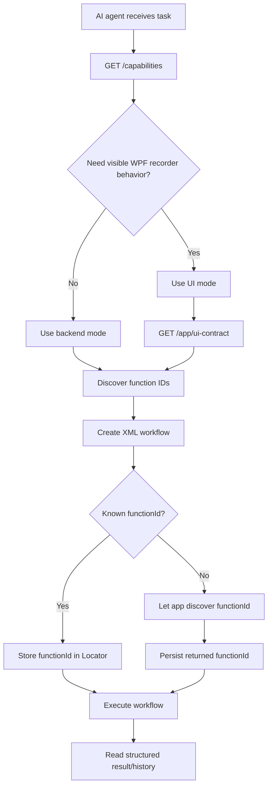
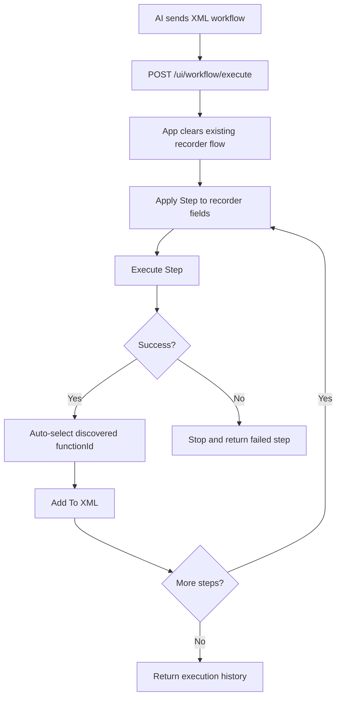
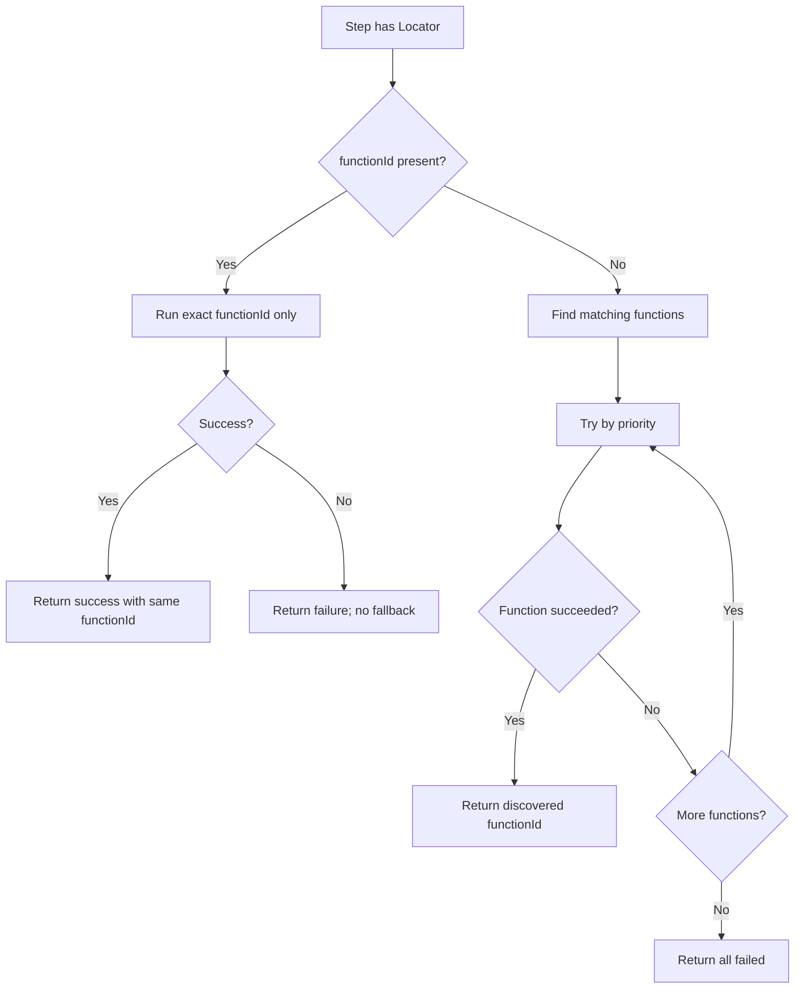
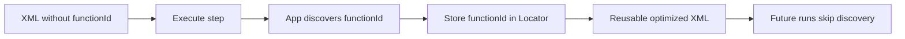

# Flow Charts

## Overall agent decision flow

```mermaid
flowchart TD
    A[AI agent receives task] --> B[GET /capabilities]
    B --> C{Need visible WPF recorder behavior?}
    C -- No --> D[Use backend mode]
    C -- Yes --> E[Use UI mode]
    D --> F[Discover function IDs]
    E --> G[GET /app/ui-contract]
    G --> F
    F --> H[Create XML workflow]
    H --> I{Known functionId?}
    I -- Yes --> J[Store functionId in Locator]
    I -- No --> K[Let app discover functionId]
    K --> L[Persist returned functionId]
    J --> M[Execute workflow]
    L --> M
    M --> N[Read structured result/history]
```

## UI mode flow

```mermaid
flowchart TD
    A[AI sends XML workflow] --> B[POST /ui/workflow/execute]
    B --> C[App clears existing recorder flow]
    C --> D[Apply Step to recorder fields]
    D --> E[Execute Step]
    E --> F{Success?}
    F -- Yes --> G[Auto-select discovered functionId]
    G --> H[Add To XML]
    H --> I{More steps?}
    I -- Yes --> D
    I -- No --> J[Return execution history]
    F -- No --> K[Stop and return failed step]
```

## Strategy function selection flow

```mermaid
flowchart TD
    A[Step has Locator] --> B{functionId present?}
    B -- Yes --> C[Run exact functionId only]
    C --> D{Success?}
    D -- Yes --> E[Return success with same functionId]
    D -- No --> F[Return failure; no fallback]
    B -- No --> G[Find matching functions]
    G --> H[Try by priority]
    H --> I{Function succeeded?}
    I -- Yes --> J[Return discovered functionId]
    I -- No --> K{More functions?}
    K -- Yes --> H
    K -- No --> L[Return all failed]
```

## XML reuse loop

```mermaid
flowchart LR
    A[XML without functionId] --> B[Execute step]
    B --> C[App discovers functionId]
    C --> D[Store functionId in Locator]
    D --> E[Reusable optimized XML]
    E --> F[Future runs skip discovery]
```
